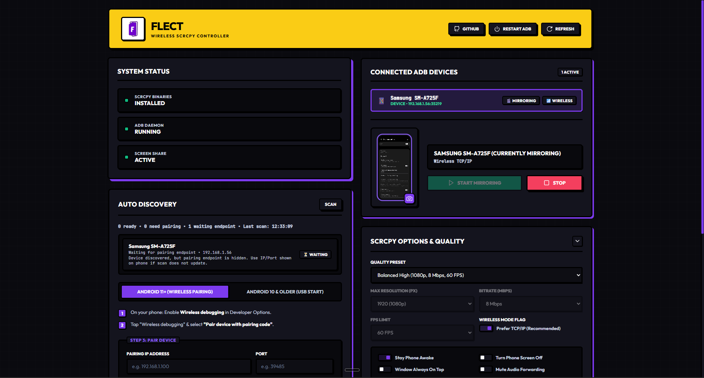

<div align="center">


# Flect

*Wireless Android screen mirroring for Windows — from your browser.*

[](LICENSE)
[](https://github.com/Llewellyn500/flect/actions/workflows/ci.yml)
[](https://github.com/Llewellyn500/flect/issues)
[](CONTRIBUTING.md)

[Preview](#preview) · [Showcase](#showcase) · [Features](#features) · [Getting started](#getting-started) · [Usage](#usage) · [Scripts](#scripts) · [Contributing](#contributing)

</div>

---

**Flect** is an open-source local web dashboard for [scrcpy](https://github.com/Genymobile/scrcpy) on Windows. Pair over Wi‑Fi, connect in a click, mirror your screen, tweak quality live, record sessions, and capture previews — no USB cable required.

> **Note:** Flect runs on `localhost` only. It is a desktop companion app, not a hosted service.

<br>

## Preview

<p align="center">
  
</p>

<br>

## Showcase

https://github.com/LAP-Tutorials/flect/public/flect-demo.mp4

<br>

## Features

- **Bundled scrcpy** — Official Windows scrcpy + adb binaries included in `scrcpy-win64/`
- **Wireless pairing wizard** — Handles the `adb pair` handshake so you never touch a terminal
- **Device discovery** — Auto-scan the network for wireless debugging endpoints + manual rescan
- **Full mirroring controls** — Resolution, bitrate, FPS, stay awake, turn screen off, always on top, touch indicators, audio toggle
- **Live settings** — Apply supported options while a session is already running
- **Screen recording** — Save MP4s to `./recordings` with graceful stop so files stay playable
- **Screen preview** — Capture a still snapshot in the phone mockup; auto-saved to `./screenshots`
- **Device memory** — Remembers human-readable device names across reconnects
- **Real-time dashboard** — Dark UI, toast notifications, and live logs over SSE

<br>

## Getting started

### Prerequisites

| Requirement | Details |
|-------------|---------|
| **OS** | Windows 10/11 |
| **Runtime** | [Node.js 18+](https://nodejs.org/) |
| **Network** | PC and phone on the same Wi‑Fi |
| **Phone** | Android 11+ with **Wireless debugging** enabled |

Enable wireless debugging on your phone:

`Settings → Developer options → Wireless debugging`

### Install

**Option A — Windows launcher (recommended)**

Double-click [`run.bat`](run.bat). It installs dependencies if needed and starts the server.

**Option B — Git clone**

```bash
git clone https://github.com/Llewellyn500/flect.git
cd flect
npm install
npm start
```

Open **[http://localhost:3000](http://localhost:3000)** in your browser.

<br>

## Usage

### 1. Pair your phone (first time only)

1. On your phone: *Wireless debugging → Pair device with pairing code*
2. In Flect: open the **Pairing Wizard** tab
3. Enter the IP, port, and 6-digit code shown on your phone
4. Click **Pair Device**

### 2. Connect wirelessly

1. On your phone's main **Wireless debugging** screen, note the IP and port (this port differs from the pairing port)
2. Enter them in the **Connect** section
3. Click **Connect**

### 3. Start mirroring

1. Select your device in **Active ADB Devices**
2. Adjust settings (quality preset, stay awake, record, etc.)
3. Click **Start Mirroring**

Recordings land in `./recordings`. Preview captures land in `./screenshots`.

<br>

## Scripts

| Command | Description |
|---------|-------------|
| `npm start` | Start the Flect web dashboard |
| `npm run check` | Syntax-check server, client, and scripts |
| `npm run update:scrcpy` | Update `scrcpy-win64/` to the latest official release |

<br>

## How it works

<details>
<summary><strong>Headless session escape</strong></summary>

<br>

Background Node processes can spawn GUI apps in Windows Session 0 (invisible to the user). Flect launches scrcpy through `explorer.exe` and a temporary `_flect_launch.bat`, forcing the mirror window onto your interactive desktop.

</details>

<details>
<summary><strong>TLS target resolution</strong></summary>

<br>

Android wireless debugging advertises both IP:port and mDNS TLS endpoints. Flect resolves TLS-style device IDs to their working IP:port before launching scrcpy.

</details>

<details>
<summary><strong>Pairing handshake</strong></summary>

<br>

`adb pair` requires stdin for the 6-digit code. Flect spawns the process and writes the code immediately — no manual terminal step.

</details>

<details>
<summary><strong>Recording finalization</strong></summary>

<br>

Stopping a recording closes the scrcpy window gracefully (with a longer grace period) so the MP4 `moov` atom is written and files stay playable.

</details>

<br>

## Project structure

```
flect/
├── public/              # Dashboard (HTML, CSS, JS, icons)
│   └── images/logo.png  # Canonical logo — run generate:assets after edits
├── server.js            # Express API + ADB/scrcpy process manager
├── scripts/
│   ├── update-scrcpy.js
│   └── generate-brand-assets.js
├── run.bat              # Windows one-click launcher
├── scrcpy-win64/        # Bundled scrcpy + adb binaries
├── recordings/          # Session MP4s (gitignored)
└── screenshots/         # Preview PNGs (gitignored)
```

<br>

## Development

```bash
git clone https://github.com/Llewellyn500/flect.git
cd flect
npm install
npm start
```

Run checks before opening a PR:

```bash
npm run check
```

See **[CONTRIBUTING.md](CONTRIBUTING.md)** for the full workflow, code guidelines, and issue templates.

<br>

## Contributing

Contributions are welcome — bugs, features, docs, and UI polish.

- [Report a bug](https://github.com/Llewellyn500/flect/issues/new?template=bug_report.yml)
- [Request a feature](https://github.com/Llewellyn500/flect/issues/new?template=feature_request.yml)
- [Read the contributing guide](CONTRIBUTING.md)
- [Code of Conduct](CODE_OF_CONDUCT.md)

If Flect saves you time, consider **starring the repo** — it helps others discover the project.

<br>

## Security

Flect is designed for **local use only**. Do not expose port `3000` to the public internet or bind it to `0.0.0.0` without understanding the risks.

To report a vulnerability privately, see **[SECURITY.md](SECURITY.md)**.

<br>

## Acknowledgements

Flect is built on top of excellent open-source tools:

- [scrcpy](https://github.com/Genymobile/scrcpy) by Genymobile — screen mirroring engine
- [Android Debug Bridge (adb)](https://developer.android.com/tools/adb) — device communication

<br>

## License

[Flect Non-Commercial License v1.0](LICENSE) © 2026 [Llewellyn Adonteng Paintsil](https://github.com/Llewellyn500)

**You may** use, modify, and share Flect for personal, educational, and non-commercial open-source projects.

**You may not** sell Flect or use it in paid products or commercial services without written permission. For commercial licensing, contact **Llewellynpaintsil34@gmail.com**.

> Flect builds on [scrcpy](https://github.com/Genymobile/scrcpy) and other third-party tools, which remain under their own licenses.
